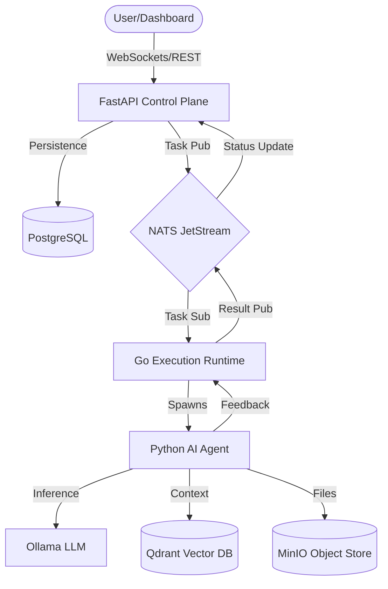

# AgentOps System Architecture Specification

**Date:** 2026-04-26  
**Status:** Canonical  
**Version:** 1.1

---

## 1. Executive Summary & Philosophy

AgentOps is a multi-agent autonomous workflow platform designed for **Ephemeral High-Compute Scaling**. The system leverages a hybrid architecture that separates a permanent, low-resource Control Plane from on-demand, high-performance GPU worker instances (Vast.ai) to maximize cost efficiency and computational throughput.

### 1.1 Core Design Pillars
*   **High Concurrency & Reliability:** Utilizing Go for the execution engine to handle thousands of concurrent agent tasks with minimal overhead.
*   **On-Demand GPU Scaling:** Provisioning ephemeral RTX 4090/H100 instances only when active objectives are scheduled.
*   **Decoupled Multi-Language Stack:** Using the "best tool for the job"—FastAPI for coordination, Go for performance runtime, and Python for AI logic.
*   **Hybrid Persistence:** Combining local ephemeral storage (for execution speed) with remote persistent masters (for long-term state).

### 1.2 System Interaction Flow

---

## 2. Component Architecture

### 2.1 Control Plane (FastAPI)
The FastAPI service acts as the system's "Brain" and primary interface.
*   **Responsibilities:** REST API management, WebSocket stream handling, and **Instance Lifecycle Orchestration**.
*   **Instance Management:** Triggers Vast.ai provisioning based on task queue depth and terminates instances upon objective completion.
*   **Communication:** Interacts with the **Master PostgreSQL** and publishes tasks to NATS JetStream.
*   **Real-time Layer:** Uses WebSockets to provide live status updates and streaming agent logs to the frontend.

### 2.2 Execution Runtime (Go)
A high-performance runtime built in Go that manages the lifecycle of worker execution.
*   **Concurrency Model:** Uses a sophisticated Worker Pool model with Goroutines and channels to manage task execution without blocking.
*   **Messaging:** Subscribes to NATS JetStream subjects (`agent.*.*`). It handles message acknowledgment, backpressure, and automatic retries.
*   **Supervision:** Monitors worker health and manages resource isolation for the Python execution processes.

### 2.3 Frontend Strategy (Next.js)
The user interface is decoupled from the core infrastructure to maximize resource availability for AI inference.
*   **Hosting:** Deployed on Vercel to offload static asset serving and UI rendering.
*   **Interaction:** Communicates with the Control Plane via authenticated API calls and WebSockets.

---

## 3. Data & Storage Infrastructure

### 3.1 Messaging Backbone (NATS JetStream)
NATS provides the central nervous system for the platform.
*   **Durable Streams:** All task transitions are recorded in durable streams, ensuring at-least-once delivery.
*   **Subject Pattern:** Uses hierarchical subjects like `agent.{type}.{stage}` (e.g., `agent.planner.start`) for granular routing.
*   **Reliability:** Implements failure detection and message re-delivery if a worker node or process crashes.

### 3.2 Persistent State (PostgreSQL)
The source of truth for all structured data.
*   **Storage:** Workflow definitions, task states (Created -> Running -> Completed), approval logs, and user metadata.
*   **Schema Evolution:** Managed via Alembic (Python) and golang-migrate (Go) to ensure database consistency across updates.

### 3.3 Vector Memory (Qdrant)
Provides "Long-term Memory" for agents.
*   **Retrieval:** Stores high-dimensional embeddings of previous agent actions and project context.
*   **Ephemeral Strategy:** Collections are created on-demand on worker nodes; snapshots are synced to remote storage before instance destruction.

### 3.4 Caching & Orchestration (Redis)
A low-latency in-memory store.
*   **Usage:** Distributed locking to prevent race conditions in task scheduling, short-term task state caching, and rate-limiting enforcement.

### 3.5 Artifact Storage (MinIO)
A self-hosted, S3-compatible object store.
*   **Strategy:** Centralizes all files generated by agents (source code, media, logs).
*   **Access:** Provides a unified API for Python workers and the Go runtime to store and retrieve binary data without local path dependencies.

---

## 4. AI & Agent Execution Model

### 4.1 Inference Engine (Ollama)
Hosts local LLMs for agent reasoning.
*   **Optimization:** Configured with Docker resource constraints to prevent inference from starving the Go Runtime or NATS.
*   **Flexibility:** Supports dynamic model swapping and local-only execution for maximum privacy.

### 4.2 Agent Lifecycle & HITL
Agents follow a standardized lifecycle: `Created -> Scheduled -> Running -> Completed/Failed`.
*   **Human-in-the-Loop (HITL):** Workflow stages can be marked as "Approval Gated." The system persists the task state to Postgres and pauses the NATS stream until an approval signal is received via the Control Plane.
*   **Standard Flow:** Planner → Reviewer → Developer → Tester → Delivery.

---

## 5. Security & Operational Excellence

### 5.1 Execution Sandboxing
To ensure system stability, all dynamic code execution is isolated.
*   **Strategy:** Developer agents execute code in dedicated, restricted Docker sidecar containers.
*   **Isolation:** Strict `cgroups` limits on CPU/Memory and restricted network egress to prevent data exfiltration.

### 5.2 Secret & Identity Management
*   **Secrets:** Credentials (LLM keys, DB passwords) are managed via Infisical or Docker Secrets and injected into workers at runtime.
*   **Identity:** Each agent and service utilizes JWT-based identities with scope-based permissions to enforce Principle of Least Privilege (PoLP).

### 5.3 Observability & Tracing
*   **OpenTelemetry (OTel):** Every request and task carries a Trace ID across the polyglot stack.
*   **Logging:** Structured JSON logging for all services, enabling deep diagnostics and failure analysis.

### 5.4 Disaster Recovery
*   **Backup:** Automated PostgreSQL WAL-G backups and volume snapshots for Qdrant/MinIO are sent to offsite S3-compatible storage.
*   **Recovery:** The single-server deployment is designed for rapid restoration from Docker Compose definitions and data snapshots.

## 6. Technical Stack Mapping

| Component | Technology | Primary Role |
| :--- | :--- | :--- |
| **API / Control** | FastAPI (Python) | Logic Coordination & UI Sync |
| **Execution Engine**| Go (Golang) | High-Concurrency Worker Pool |
| **Messaging** | NATS JetStream | Durable Event Backbone |
| **Database** | PostgreSQL | Relational System State |
| **Vector DB** | Qdrant | Semantic Agent Memory |
| **Object Store** | MinIO | Artifact & Log Storage |
| **Inference** | Ollama | Local LLM Hosting |
| **Cache/Locking** | Redis | Ephemeral State & Mutexes |
| **Observability** | OpenTelemetry | Distributed Tracing |
| **Orchestrator** | Vast.ai CLI | Ephemeral Instance Management |
| **Proxy** | Nginx | HTTPS & Routing |

---

## 7. Deployment Strategy

The system utilizes a **Split-Deployment Model**:

1.  **Permanent Control Plane (Supabase & Contabo):**
    *   Hosts the **Master PostgreSQL (Supabase)**.
    *   Hosts the **Master NATS, Redis, and MinIO (Contabo)**.
    *   Maintains the system's "Source of Truth" and orchestrates workers.

2.  **Ephemeral Worker Instances (Vast.ai):**
    *   Provisioned on-demand with 1x RTX 4090 or higher.
    *   Hosts the Go Runtime, Python Agents, Ollama, and Ephemeral Qdrant.
    *   Automatically destroyed after all assigned objectives are achieved.

3.  **Network:** Workers connect to the Control Plane via secure NATS/Postgres tunnels or authenticated public endpoints.
